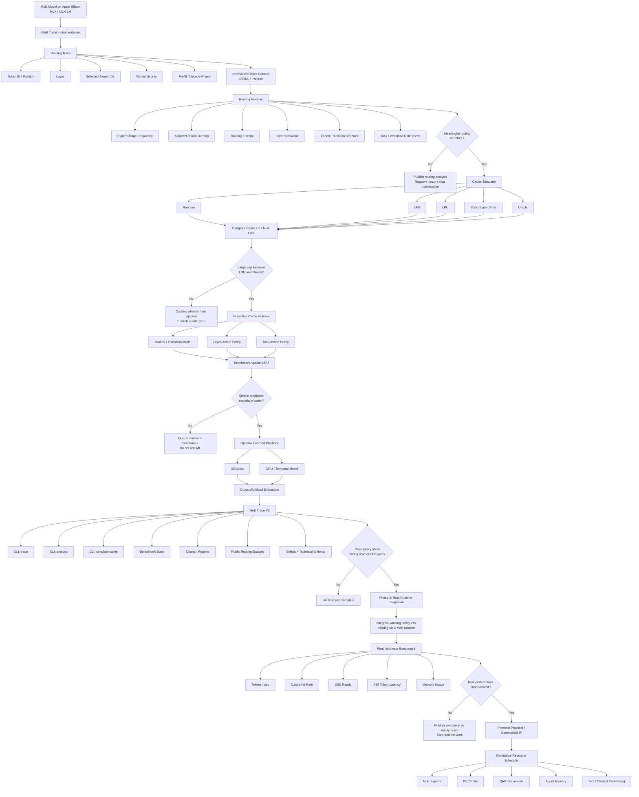

Here is the full path, from the original idea to the first serious follow-on.

## 0. Starting point: what problem are we actually exploring?

We began with FreeToken, which is trying to make very large MoE models practical on constrained hardware by deciding how model experts are stored, moved, cached, and executed.
Original FreeToken Repo: https://github.com/FlashML-org/FreeToken

The Mac-specific opportunity was not:

> “Port FreeToken to Apple Silicon.”

That is too large and too implementation-heavy.

The more useful question became:

> **Can we understand MoE expert-routing behaviour well enough to tell whether smarter memory/caching policies are possible on Apple Silicon?**

That led to **MoE Trace**.

---

# Phase 1 — Build the observability layer

## Goal

Create a small tool that can observe which experts an MoE model selects during inference, without modifying MLX itself.

This is the foundation for everything else.

### What we have already done

1. Created the public GitHub repo:
   `gajsanders/moe-trace`

2. Created a clean Python 3.12 environment.

3. Installed and verified MLX/MLX-LM.

4. Downloaded and ran:

   `mlx-community/Qwen3-30B-A3B-4bit`

5. Established a baseline:

```text
Generation throughput: ~129 tok/s
Peak memory: ~17.25 GB
```

6. Located the Qwen3 MoE router inside MLX-LM.

7. Identified the exact routing values:

```text
inds   = selected experts
scores = routing weights
```

8. Built an external tracer rather than modifying MLX-LM.

9. Normalised the trace to one record per:

```text
token × layer
```

10. Validated the output:

```text
33 tokens
48 MoE layers
1,584 routing events
0 missing pairs
0 duplicate pairs
```

So Phase 1 is effectively **complete**.

### Phase 1 success condition

We needed:

> reliable expert-selection traces from real MLX inference.

We have that.

**Continue.**

If we had been unable to observe routing cleanly without invasive MLX changes, this would have been an early point to stop or radically rethink the project.

---

# Phase 2 — Characterise how MoE routing behaves

This is where we are about to start.

We are not optimising anything yet.

We first need to answer:

> **Is there meaningful structure in expert routing?**

We will measure things like:

### A. Expert frequency

Which experts are used most often?

Example:

```text
Expert 47: 8.3%
Expert 91: 6.9%
Expert 12: 0.3%
```

Question:

> Are there “universal” experts that appear disproportionately often?

---

### B. Adjacent-token overlap

For consecutive tokens:

$$
\frac{|E_t \cap E_{t+1}|}{8}
$$

Question:

> If a token used experts 12, 28, 47..., how many of those remain useful for the next token?

This tells us how strong simple temporal locality is.

---

### C. Layer behaviour

We will ask whether early, middle, and late layers behave differently.

Example possibility:

```text
Layer 4  → 18% adjacent reuse
Layer 25 → 41%
Layer 44 → 62%
```

If that happens, a single cache policy for every layer may be suboptimal.

---

### D. Routing concentration / entropy

Does each layer spread traffic across all 128 experts?

Or does it mostly use a subset?

This matters for memory planning.

---

### E. Transition structure

Later in this phase:

$$
P(E_{t+1}=j \mid E_t=i)
$$

Does seeing expert 47 now make expert 91 unusually likely next?

That gets us beyond simple LRU.

---

# Phase 2 decision point

This is the first major **go / no-go** gate.

## If routing looks essentially random

For example:

```text
very low reuse
flat expert frequencies
weak transition structure
little difference between workloads
```

then:

> **Stop the predictive-caching direction.**

We can still publish MoE Trace as a routing-analysis tool and document the negative result, but there would be little reason to build complicated predictors.

That is a perfectly acceptable outcome.

---

## If routing shows meaningful structure

For example:

```text
some experts dominate
adjacent reuse is significant
layers behave differently
expert transitions are predictable
```

then:

> **Continue to Phase 3.**

---

# Phase 3 — Build the cache simulator

Now we stop asking:

> “What does routing look like?”

and ask:

> **Would different cache policies actually make a difference?**

We replay the recorded traces through simulated cache sizes.

For example:

```text
Cache capacity:
8 experts
16 experts
32 experts
64 experts
```

Then compare policies.

Initially:

```text
Random
LFU
LRU
Static frequency
Oracle
```

### Why Oracle matters

Oracle knows the future.

It tells us the theoretical maximum possible performance.

Suppose:

```text
LRU hit rate:     74%
Oracle hit rate:  78%
```

There are only four percentage points available.

**Stop.**

Building prediction models is probably pointless.

But suppose:

```text
LRU:     51%
Oracle:  89%
```

Now there is a huge exploitable gap.

**Continue.**

This is probably the most important stopping condition in the whole initial project.

---

# Phase 4 — Test simple predictive policies

Only if Phase 3 reveals meaningful headroom.

We start with extremely simple methods.

### Markov-1

Predict from the current expert set.

### Markov-2

Predict from the previous two routing states.

### Layer-aware frequency

Different expert priors for each layer.

### Task-aware priors

Potentially:

```text
coding
maths
reasoning
general
```

We compare all of these against LRU.

---

# Phase 4 decision point

If:

```text
LRU        60%
Markov     60.8%
Oracle     63%
```

stop.

There is insufficient practical improvement.

If instead:

```text
LRU        60%
Markov     71%
Oracle     86%
```

continue.

That would already be a useful result because an extremely cheap predictor beats ordinary caching substantially.

---

# Phase 5 — Add learned prediction

Only now do we introduce ML.

Not before.

Candidate progression:

```text
XGBoost
   ↓
possibly GRU
   ↓
possibly more advanced temporal model
```

Inputs might include:

```text
current experts
previous experts
layer
router scores
token position
recent expert frequencies
```

Output:

```text
experts likely to be required next
```

The important metric is **not raw prediction accuracy**.

It is:

> Does this reduce cache misses enough to justify the cost of running the predictor?

---

# Phase 5 decision point

Suppose:

```text
LRU      60%
Markov   71%
XGB      72%
```

Then XGBoost adds very little.

Use Markov. Stop increasing model complexity.

But if:

```text
LRU      60%
Markov   68%
XGB      78%
Oracle   86%
```

then the learned method is genuinely capturing more structure.

Continue.

---

# Phase 6 — Test across workloads

Up to this point, one prompt proves mechanics but not generality.

We would create a controlled benchmark set, perhaps:

```text
50 coding
50 maths
50 reasoning
50 general knowledge
50 retrieval
```

Then ask:

> Do routing patterns and cache-policy performance generalise?

This is where MoE Trace becomes a credible research tool rather than a toy.

---

# Phase 6 stopping condition

If the optimisation only works on one prompt category or one narrow prompt format:

> treat it as an interesting observation, not a general optimisation.

Probably stop before runtime integration.

If it works across multiple workloads:

> continue.

---

# What is the finished **initial project**?

This is important.

The initial MoE Trace project does **not** need to speed up MLX.

A successful V0.x could simply be:

> **An open-source toolkit for tracing, analysing, and benchmarking expert-routing and cache policies for MLX MoE models on Apple Silicon.**

The finished initial version would have:

```text
moe-trace trace
moe-trace analyse
moe-trace simulate-cache
```

and produce results like:

```text
Model
Number of experts
Experts/token
Expert-frequency distribution
Routing entropy by layer
Adjacent-token overlap
Transition predictability

Cache simulation:
Random
LFU
LRU
Markov
Oracle
```

That alone is a legitimate project.

It could have:

* GitHub repo
* reproducible benchmark suite
* sample traces
* charts
* README
* technical write-up

No custom Metal code required.

---

# Initial publication point

Once the characterisation and cache simulator are mature enough, publish something like:

> **MoE Trace: Measuring Expert Routing and Cache Locality in MoE Models on Apple Silicon**

The article would answer:

1. How MoE routing behaves.
2. How much temporal locality exists.
3. How much LRU captures.
4. How much theoretical improvement remains.
5. Whether simple prediction helps.

If the result is negative, publish that.

If the result is positive, that becomes the bridge to the next project.

---

# Phase 7 — The next phase: actual runtime optimisation

This is **not part of the initial project**.

Only start this if MoE Trace shows a meaningful opportunity.

The question changes from:

> “Could a better cache policy work?”

to:

> **“Does it actually make inference faster on real hardware?”**

Now we integrate the winning policy into an existing runtime.

Potentially something such as an MLX MoE offloading/streaming project rather than writing our own inference engine.

Architecture:

```text
Router
   ↓
MoE Trace-derived predictor
   ↓
cache / prefetch decision
   ↓
SSD / unified memory
   ↓
expert execution
```

Then measure:

```text
tokens/sec
time-to-first-token
P95 token latency
SSD bytes read
cache hit rate
memory use
```

---

# Next-phase decision point

This is crucial because simulated improvements don't automatically equal real speedups.

Suppose simulation says:

```text
25% fewer cache misses
```

but real inference shows:

```text
1% speed improvement
```

because prediction overhead or other bottlenecks dominate.

Then:

> **Stop.**

Useful research result, but probably not commercially interesting.

If instead:

```text
25% fewer misses
15–25% higher throughput
meaningfully lower tail latency
```

then we have something much more valuable.

---

# Phase 8 — Only if that works: broader generalisation

This is where the project might become significantly more interesting.

Ask whether the same resource-allocation framework works for:

```text
MoE experts
KV cache
RAG chunks
agent memory
tool outputs
```

The general problem becomes:

$$
\text{limited fast capacity } K
$$

plus uncertain future demand.

So:

> What should the system keep, evict, retrieve, or prefetch?

This is where the work could start connecting to your broader interest in bounded information retrieval/resource allocation.

---

# The whole roadmap in one picture

```text
FreeToken investigation
        │
        ▼
"Don't port FreeToken wholesale"
        │
        ▼
Build MoE Trace
        │
        ▼
────────────────────────────────
PHASE 1 — OBSERVE
────────────────────────────────
Run MoE on MLX
        ↓
capture expert routing
        ↓
normalise token × layer data
        ↓
validate completeness
        │
        │  ✅ WE ARE HERE
        ▼
────────────────────────────────
PHASE 2 — UNDERSTAND
────────────────────────────────
frequency
overlap
entropy
layer structure
transitions
        │
        ├── no structure ─────→ STOP
        │
        ▼
────────────────────────────────
PHASE 3 — SIMULATE
────────────────────────────────
Random
LFU
LRU
Oracle
        │
        ├── LRU ≈ Oracle ─────→ STOP
        │
        ▼
────────────────────────────────
PHASE 4 — SIMPLE PREDICTION
────────────────────────────────
Markov
layer-aware policies
task-aware policies
        │
        ├── no useful gain ───→ STOP
        │
        ▼
────────────────────────────────
PHASE 5 — LEARNED PREDICTION
────────────────────────────────
XGBoost
possibly GRU
        │
        ├── complexity adds
        │   little value ─────→ use simple model / STOP
        ▼
────────────────────────────────
PHASE 6 — GENERALISE
────────────────────────────────
multiple tasks
multiple prompts
possibly multiple MoEs
        │
        ├── doesn't generalise → publish narrow result / STOP
        │
        ▼
===============================
 INITIAL MOE TRACE COMPLETE
===============================
GitHub
benchmark
dataset
technical write-up
        │
        ▼
────────────────────────────────
PHASE 7 — REAL RUNTIME
────────────────────────────────
integrate winning policy
into existing MLX runtime
        │
        ├── no real speedup ───→ STOP
        │
        ▼
real inference improvement
        │
        ▼
────────────────────────────────
PHASE 8 — GENERAL RESOURCE
SCHEDULING
────────────────────────────────
MoE
KV
RAG
agent memory
...
```

## Where we are right now

We have completed the **instrumentation foundation**.

The next command we write should therefore not touch the model at all.

It will simply take:

```text
results/routing_trace.jsonl
```

and answer our first real question:

> **How much expert overlap exists between consecutive tokens, overall and by layer?**

That is the correct next step because it starts determining whether there is actually enough temporal structure to justify continuing.

Yes. I’d separate the **initial MoE Trace product** from the optional research/runtime extensions. The end state should look roughly like this:



### The important boundary

The box labelled **`MoE Trace V1`** is the finished initial project.

You **do not need to reach runtime integration for MoE Trace to succeed**.

The core finished product is essentially:

```text
             MoE model
                 │
                 ▼
             TRACE IT
                 │
                 ▼
        Understand routing
                 │
                 ▼
          SIMULATE caching
                 │
                 ▼
       Compare strategies
                 │
                 ▼
     Is optimisation possible?
```

Only if the answer at the bottom is convincingly **yes** do we move into:

```text
prediction
    ↓
real runtime integration
    ↓
actual speed improvement
    ↓
possible reusable IP
```

And **right now**, we are here:

```text
MoE Model
    ↓
Instrumentation        ✅
    ↓
Normalised Dataset     ✅
    ↓
Routing Analysis       ← NEXT
    ↓
Cache Simulator
```

So we are still very early, but importantly we have already completed the piece that proves the basic project is technically feasible.
